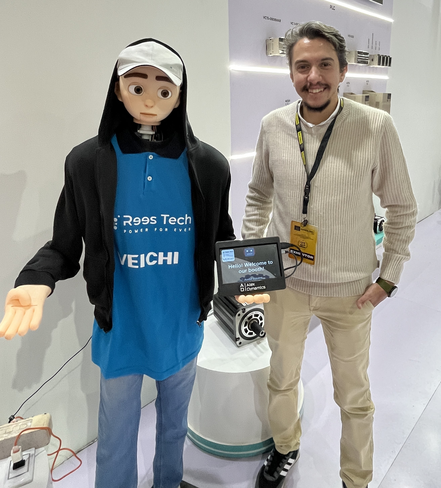

# ALEX Humanoid Robot
<!---->

A modular, stationary humanoid robot head designed for real-world interaction and public demonstrations. Built with ROS2 Humble, Raspberry Pi 4, and a custom 3D-printed mechanical system.

**Status**: Operational. Post-exhibition modifications in progress based on MACTECH 2025 field observations.

---

## Project Overview

| Attribute | Detail |
|---|---|
| **Name** | ALEX |
| **Type** | Stationary humanoid head (torso-mounted) |
| **Purpose** | Public demonstration, human-robot interaction, educational outreach |
| **Status** | v1.0 demonstrated at MACTECH 2025; v1.1 in development |
| **Development Period** | October 2025 – November 2025 (approximately 5 weeks, priority project) |
| **Team** | Primary Developer (AI-assisted development workflows) |

---

## What ALEX Does

ALEX detects visitors via face detection, tracks them with a 3-DOF neck mechanism, makes eye contact, blinks naturally, speaks pre-recorded Arabic introductions, and ejects informational cards on trigger. It was designed for sustained operation in crowded exhibition environments.

**Demonstrated Behaviors**:
- Face detection and tracking (Haar cascades + IOU matching)
- 3-DOF head motion (pan, tilt, roll) via differential mechanism
- Eye contact and gaze following
- Natural blinking (randomized interval, approximately 2.5–6.5 seconds, with brief 0.3-second duration)
- Synchronized jaw motion with audio playback
- Card ejection on software trigger (configured with a 38-second delay)
- Idle scanning behavior with randomized micro-saccades

---

## System Architecture

**Full architecture details**: [docs/system-architecture.md](docs/system-architecture.md)

---

## Hardware BOM

| Component | Specification | Quantity | Role |
|---|---|---|---|
| Compute | Raspberry Pi 4 (4GB) | 1 | ROS2 middleware, vision, behavior, UI server |
| Microcontroller | Arduino Mega 2560 | 1 | Real-time servo control |
| PWM Driver | Adafruit PCA9685 (16-ch, I2C) | 1 | Servo PWM generation |
| Camera | Raspberry Pi Camera Module v2 (IMX219) | 1 | Face detection input |
| Display | 7" HDMI LCD + Chromium Kiosk | 1 | User interface |
| Neck Servos | TowerPro MG996R | 3 | 3-DOF differential neck |
| Face Servos | TowerPro MG90S | 6 | Eyelids, eyes, jaw |
| Card Ejector Servo | TowerPro MG90S | 1 | Linear card ejection |
| Power (Pi) | 5V/3A USB-C adapter | 1 | Raspberry Pi + peripherals |
| Power (Servos) | 6V/5A+ DC supply | 1 | Servo rail |
| Structural Frame | PETG (3D printed, SolidWorks) | 1 set | Internal mechanics |
| Head Shell | PLA (3D printed, Blender) | 1 set | External aesthetic cover |

**Total actuated DOF**: 9 (3 neck + 5 face + 1 card ejector)

---

## Software Stack

| Layer | Technology | Version |
|---|---|---|
| OS | Ubuntu | 22.04 LTS |
| Middleware | ROS2 | Humble |
| Vision | OpenCV | 4.x |
| Face Detection | Haar Cascades | frontalface_default |
| Language | Python | 3.x |
| UI | Chromium + rosbridge | WebSocket |
| Audio | mpg123 | CLI subprocess |
| CAD (Mechanical) | SolidWorks |  |
| CAD (Aesthetic) | Blender |  |

### ROS2 Nodes

| Node | Purpose |
|---|---|
| `face_tracking_node` | Face detection, IOU tracking, position publish |
| `head_controller_node` | Smoothing, kinematics, serial output |
| `interaction_controller_node` | Behavior state machine, audio sync |

**Full node documentation**: [docs/ros2-node-reference.md](docs/ros2-node-reference.md)

---

## Mechanical Design

### 3-DOF Pan and Dual-Tilt Neck

The neck uses one MG996R servo for pan (yaw) and two MG996R servos working together as a tilt pair for pitch and roll. The pan axis is mechanically decoupled from the tilt platform, simplifying control logic. The tilt pair shares the head load during motion. The mechanism was designed in SolidWorks with kinematic verification.

### Face Assembly

- **Eyes**: 2-DOF gimbal (pan and tilt) driven by two MG90S servos, allowing fine gaze tracking independent of head motion
- **Upper and Lower Eyelids**: MG90S-driven 4-bar linkage, rapid motion for natural blinking and expression control
- **Mouth (Jaw)**: MG90S-driven lever with passive close (spring/gravity), active open
- **Card Ejector**: MG90S-driven linear slide, software-triggered

**Full mechanical documentation**: [docs/mechanical-design-notes.md](docs/mechanical-design-notes.md)

---

## Project Outcomes

The following outcomes were verified through project documentation and exhibition deployment:

- **Successful public demonstration**: ALEX operated continuously during MACTECH 2025, a public exhibition in Egypt held at the end of December 2025, engaging with visitors in a crowded environment.
- **Architecture validation**: The layered architecture (Pi 4 for ROS2 + Arduino for real-time control) proved stable under sustained operation and handled the exhibition workload without software crashes.
- **Mechanical validation**: The 3D-printed differential neck mechanism and face linkage operated throughout the event. Post-examination revealed minor wear consistent with expected FDM part lifecycle.
- **Integration experience**: The project provided hands-on experience integrating computer vision, middleware, embedded control, and mechanical systems into a single demonstrable platform.
- **Field data collection**: Exhibition operation revealed actionable insights for the next iteration, including thermal management needs and compute headroom limitations.
- **Platform development experience**: ALEX served as an internal development platform for Alex Dynamics, validating rapid prototyping workflows and AI-assisted engineering practices.

---

## Exhibition History

### MACTECH 2025

| Attribute | Detail |
|---|---|
| **Event** | [MACTECH](https://mactech-eg.com/) |
| **Location** | Egypt |
| **Date** | End of December 2025 |
| **Frequency** | Annual (held end of December yearly) |
| **Operating Hours** | Full exhibition days (8+ hours/day) |
| **Visitors** | Crowded public environment |
| **Outcome** | Successful demonstration; field observations collected for v1.1 improvements |

**Post-Exhibition Findings**:
- Servos showed noticeable warming under continuous operation, suggesting the need for thermal management or duty-cycle limiting in future deployments.
- Raspberry Pi 4 CPU load increased during periods with multiple simultaneous faces in frame, indicating the compute platform is near its practical limit for this application.
- Face realism and expression range were well-received by visitors but identified as the primary area for improvement.
- Serial communication and mechanical reliability remained stable throughout the event.

**Full deployment log**: [docs/exhibition-deployment-log.md](docs/exhibition-deployment-log.md)

---

## Development Process

### Timeline

| Phase | Duration | Activities |
|---|---|---|
| Ideation & Planning | 1 week | AI-assisted goal refinement, shape research, system architecture planning |
| Mechanical Design | 1.5 weeks | SolidWorks internal frame, Blender outer shell, 3D printing, assembly |
| Electronics & Wiring | 0.5 weeks | Pi + Arduino + PCA9685 integration, power distribution, cable management |
| Software Development | 1.5 weeks | ROS2 application nodes, face detection, behavior logic, serial protocol, UI kiosk |
| Integration & Testing | 0.5 weeks | Full system test, calibration, exhibition environment simulation |
| Exhibition Deployment | 3 days | MACTECH setup, operation, observation collection |

### AI-Assisted Development

AI tools were used as an accelerator, not a replacement for engineering judgment:

**AI-assisted**:
- Blender proportion refinement and surface flow optimization
- ROS2 node scaffolding and callback structure generation
- Differential kinematics equation derivation
- Serial protocol design review
- Debugging suggestions (buffer sizes, timing analysis)
- Documentation drafting

**Engineer-led**:
- All mechanical design decisions and tolerance analysis
- Hardware selection and power budget calculations
- Exhibition parameter tuning (lighting, crowd behavior, audio levels)
- Physical assembly, calibration, and debugging
- Thermal and reliability validation
- Architecture decisions (Pi + Arduino separation, ASCII protocol, power isolation)

**Honest disclosure**: This project demonstrates modern engineering tool fluency. AI tools accelerated development significantly, but all critical decisions (architecture, safety, reliability) were made by the engineer. The AI-suggested binary serial protocol was abandoned in favor of a simpler ASCII protocol after physical testing revealed synchronization issues.

## Future Development Roadmap

The following items are planned or under consideration for future iterations. They are **not** implemented in the current version.

- **Compute upgrade**: Evaluate NVIDIA Jetson Orin Nano or Intel NUC to reduce face-detection latency and provide headroom for additional perception features.
- **Actuator upgrade**: Replace servos with higher-reliability digital servos or add thermal management for continuous-duty exhibition use.
- **Enhanced facial expressions**: Research silicone skin molding and additional micro-expression channels (eyebrows, lip corners) for more natural interaction.
- **Speech recognition**: Add microphone array and lightweight speech-to-text for verbal interaction beyond pre-recorded audio.
- **LLM-assisted interaction**: Evaluate lightweight language models for context-aware responses, contingent on compute upgrade.
- **Improved maintenance**: Design quick-release neck coupling and modular servo cartridges for faster field servicing.
- **Power monitoring**: Add current sensing on the servo rail for predictive thermal management and fault detection.
- **Sensor fusion**: Add IMU to the neck frame for closed-loop position verification.

---

## What I Would Do Differently (v1.1)

1. **Compute**: Upgrade from Raspberry Pi 4 to a more capable platform for lower face-detection latency and headroom for future features.
2. **Actuators**: Move to higher-reliability digital servos or implement active thermal management for the neck.
3. **Face**: Begin R&D on silicone skin molding for more natural expressions.
4. **Thermal**: Add current monitoring and software duty-cycle limiting based on observed thermal behavior at MACTECH.
5. **Documentation**: Maintain living build notes during assembly rather than reconstructing post-build.

---

---

## Skills Demonstrated

This project demonstrates capability in:

- **System Architecture**: Layered compute/control/actuator design with protocol specification
- **Robotics Integration**: ROS2 Humble application development, sensor integration, kinematics, behavior programming
- **Mechatronics**: Differential mechanism design, actuator selection, power distribution
- **Embedded Systems**: Arduino real-time control, I2C bus management, serial protocols
- **Computer Vision**: OpenCV face detection, tracking algorithms, performance optimization on constrained hardware
- **Product Development**: Rapid prototyping (approximately 5-week timeline), exhibition readiness, field validation
- **Technical Documentation**: Architecture docs, API references, deployment procedures, lessons learned
- **Technical Leadership**: Led and executed the majority of development activities using AI-assisted workflows, scope control, risk assessment, post-mortem analysis

---

## Contact

**Abdelaziz Elmasry**  
Co-Founder & Technical Lead, Alex Dynamics  
Alexandria, Egypt

- LinkedIn: [linkedin.com/in/abdelaziz-elmasry-07051997](https://linkedin.com/in/abdelaziz-elmasry-07051997)
- Email: [Abdelaziz.Ahmed.Elmasry@gmail.com](mailto:Abdelaziz.Ahmed.Elmasry@gmail.com)
- Portfolio: [github.com/AbdelazizElmasry/portfolio](https://github.com/AbdelazizElmasry/portfolio)

---

## Acknowledgments

- AI-assisted development tools for acceleration in ideation, coding, and documentation
- MACTECH organizers and visitors for the exhibition opportunity and feedback
- Open Robotics for ROS2 Humble and the rosbridge_suite package
- Adafruit for the PCA9685 PWM driver library

---

*This repository is a technical case study. All hardware designs, software architecture, and documentation are original work by Abdelaziz Elmasry, with AI assistance as noted. No confidential or proprietary information is disclosed.*
